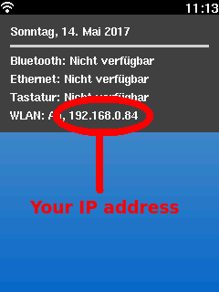
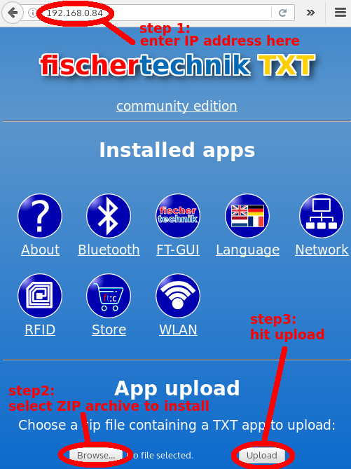

# Apps for the community firmware

This repository contains apps for the [TXT community firmware](https://github.com/ftCommunity/ftcommunity-TXT).

These are test and demo programs. They may not be finished or may have some
flaws which is the reason why they are distributed this way and not via
the store app of the community firmware.

# Installation

You can install these apps by using a web browser to upload the apps to your TXT. First you need to figure out the IP address of your TXT. This can e.g. be
done from the drop down menu in the main screen:

Then open a browser, point it to the IP address you just found out. Afterwards select a ZIP file you downloaded from this repository which you want to upload and finally hit the upload button:

